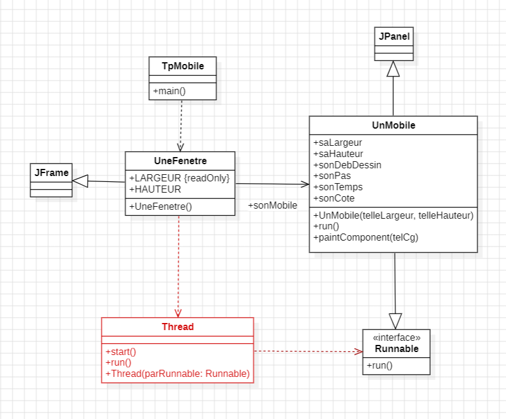

## Rapport du TP1 : Thread Java

**Exercice I** 

Pour cet exercice un code nous a été fourni dans lequel il y avait :

- Une classe **UnMobile** qui étend JPanel et implémente Runnable. Elle représente un mobile qui se déplace horizontalement dans une fenêtre.
- Une Classe **UneFenetre** qui étend JFrame, crée une instance de UnMobile, et lance un thread pour gérer le mouvement.
- Une classe **TPMobile** qui instancie la classe UneFenetre. Il s’agit ici du Main.

Le but de ce premier exercice était d’écrire le code afin que le mobile inverse sa direction une fois arrivé au bout de la fenêtre.

**Exercice II** 

Dans cet exercice, il fallait ajouter un bouton Start/Stop ayant pour but d’arrêter le mobile une fois que celui-ci était en marche ou de le refaire avancer s’il était en pause. 

Pour cela, il a fallu créer une variable booléenne isRunning instanciée a true et lorsque l’on clique sur le bouton cela appelle la méthodes suspend() ou resume() sur le thread afin de l’arreter si isRunning est à true ou de reprendre si il est à false.

**Exercice III** 

Pour finir, dans ce dernier exercice il fallait créer un deuxième mobile en séparant la fenêtre afin d’afficher les deux mobiles. Chacun de ses deux mobiles avait son propre thread ainsi qu’un bouton associé à celui-ci de sorte à ce que chaque bouton agisse sur un seul mobile qui fonctionnait juste pour lui.

## Rapport du TP2 : Thread Java

**Exercice I** 
Pour cet exercice nous avions deux tâches TA et TB. Chacune de ces tâches avait un rôle précis. La première tâche TA affichait le message « AAA » tandis que le message de la tâche TB est « BB ». Le but était d’afficher le message de l’une des tâches avant celui de l’autre. Ainsi le message devait être soit AAABB soit BBAAA.
Pour cela il a fallu créer :
-	La classe **Main** qui permet de lancer le programme et d’instancier et de démarrer les différentes tâches.
-	Une classe **Affichage** qui étend Thread. Cette cl	asse a pour but d’afficher les différents messages des tâches grâce à une boucle contenant la méthode System.out.print()

Pour faire en sorte que la boucle affiche les messages dan le bonne ordre (« AAABB » ou «BBAAA » et non « AABAB » ou « BAAAB » ou autre) il a fallu utiliser la méthode synchronized.
Cette méthode permet de s’assurer que la section critique est utilisée seulement par un seul thread a chaque fois afin que chaque thread affiche son message en entier avant qu’un autre affiche son message également. 
Pour faire cela il y a 2 méthodes possible : 
-	Celle où on ne connaît pas la ressource critique. Pour cela on crée une fausse classe Exclusion puis on synchronized sur cette classe

-	Celle où on connaît la ressource critique comme dans l’exercice où il s’agit de « out ». Dans ce cas il faut faire ce qui est dans le code de Affichage.java
  
**Exercice II**

Dans cet exercice, il fallait reprendre l’exercice 1 mais en utilisant cette fois-ci la classe semaphoreBinaire.
Cette classe fonctionne de la manière suivante. Tout d’abord, elle étend la classe semaphore.
Ensuite, elle implémente un sémaphore binaire, où la valeur est soit 0, ce qui signifie que la ressource critique est utilisé/occupé soit 1 ce qui signifie qu’elle est libre. 
Cela permet de contrôler l’accès à la ressource critique par les threads.
Ensuite, il faut mmodifier la classe Affichage. Pour cela, on utilise la méthode syncWait() avant la section critique afin de prévenir les threads qu’un autre thread utilise cette section. Une fois fini il y a un appelle de la méthode syncSignal() qui signale que la ressource a été liberée par un Thread et qu’elle est maintenant libre.

