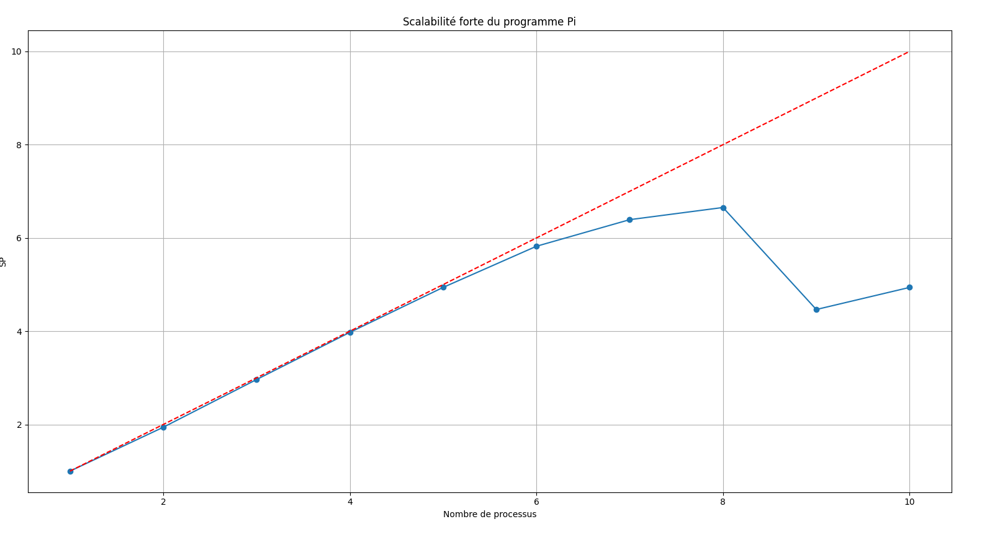
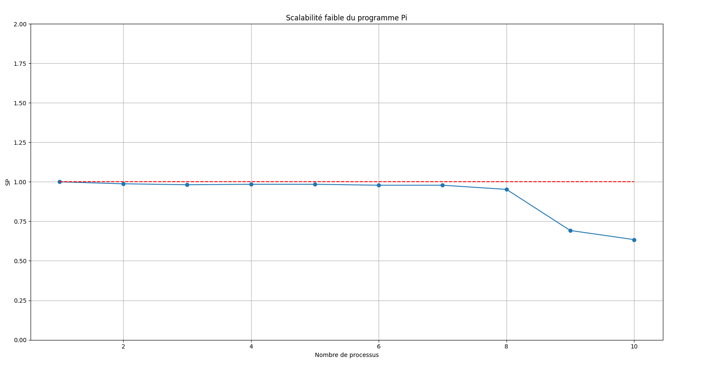

# Rapport TP4


## Table des matières
- [Introduction](#introduction)
- [I. Généralités](#i-généralités)
- [II. Algorithme](#ii-algorithme)
- [III. Parallélisation](#iii-parallélisation)
  - [Itération parallèle](#itération-parallèle)
  - [Master/Worker](#masterworker)
- [IV. Implémentation](#iv-implémentation)
- [V. Mesures de performances](#v-mesures-de-performances)
- [VI. Mémoire distribuée](#vi-mémoire-distribuée)

## Introduction

Dans ce TP, le but était d'implémenter un algorithme de Monte-Carlo afin de calculer la valeur de π. Pour ce faire, nous avons exploité le parallélisme en mémoire distribuée et en mémoire partagée.

Le répertoire `TP4_Monte_Carlo` contient les différents codes mis en place pour calculer π et effectuer des mesures de performances sur différents paradigmes.

###### Ce rapport a été écrit avec l'aide d'une IA, notamment pour la mise en page et la reformulation de certaines parties afin de faciliter la lecture et la compréhension du document.

## I. Généralités

### Qu'est-ce qu'un algorithme de Monte-Carlo ?

Un algorithme de Monte-Carlo est un algorithme basé sur de l'aléatoire et dont le temps d'exécution est déterministe. Il s'agit donc d'un algorithme utilisant une source aléatoire mais dont le temps d'exécution est connu à l'avance. L'intérêt de ce type d'algorithme est d'obtenir un résultat de façon rapide tout en ayant une probabilité d'échec faible.

La méthode de Monte-Carlo a été inventée en 1947 par [Nicholas Metropolis](https://fr.wikipedia.org/wiki/Nicholas_Metropolis) et faisait allusion au jeu de hasard pratiqué dans le casino de Monte-Carlo.

De nos jours, ces méthodes de Monte-Carlo sont souvent utilisées pour le calcul d'intégrales de dimension supérieure à 1 Mais égalemment pour introduire une approche statistique du risque dans une décision financière.

Elle peut être égalemment être utilisé pour plein d'autre méthode de calcul tel que le calcul de la valeur de coup dans certains jeu (Go, échec), mais aussi pour calculer la probabilité de la performance en bourse.

Dans ce rapport nous allons montré comment fonctionne cet algorithme a travers le calcul de la valeur π, comment peut-il être implementer en java et nous allons égalemment effectuer le calcul de ses perforamances.

## II. Algorithme

##### Nous allons a présent montrer l'appliction de l'algorithme de Monte-Carlo à travers le calcul de π.

Pour calculer π avec la méthode de Monte-Carlo, on commence par tracer un carré de côté 1. Puis, à l'interieur de ce carré, on trace maintenant un quart de cercle de rayon 1\


On effectue ensuite le tirage d'un grand nombre de points aléatoires à l'intérieur de ce carré de côté 1.\


Ainsi, la probabilité que le point soit à l'intérieur du quart de cercle est égale à :

$$ \frac{\text{Aire du quart de cercle}}{\text{Aire du carré}} = \frac{\frac{1}{4} \pi r^2}{r^2} $$

sachant que l'aire du quart de cercle est égale à $\frac{1}{4} \pi r^2$ et que l'aire du carré est égale à $r^2$ soit 1, on obtient ainsi que P(point dans le quart de cercle) qui est aussi P(distance du points <= 1) est égale à :

$$ \frac{\frac{1}{4} \pi r^2}{r^2} =  \frac{\pi}{4}$$

La probabilité P(X) doit être approché par le nombre de points dans le quart de cercle divisé par le nombre total de points ($\frac{\text{ncible}}{\text{ntotal}}$) avec ntotal un grand nombre pour plus d'exactitude.\
Ainsi, on peut approcher π par :\
P = $\frac{π}{4}$ ≃ $\frac{\text{ncible}}{\text{ntotal}}$ => π ≃ 4 * $\frac{\text{ncible}}{\text{ntotal}}$ 

#### Pseudo code de l'algorithme de base 
``` java
ncible = 0
for (p = 0; ntotal > 0; ntotal--){
    x_p, y_p = random.random(), random.random(); // Géneration d'un point aléatoire entre 0 et 1
    if (x_p**2 + y_p**2 <= 1){  // Si la distance du point est inférieur ou égale à 1 donc dans le quart de cercle
        ncible ++;
    }
}
pi = 4 * ncible / ntotal;

```

## III. Parallélisation

Nous allons a présent voir différent parallélisation de l'algorithme de Monte-Carlo pour le calcul de π.

### Itération parallèle

Tout d'abord on commence par choisir un modèle de parallélisation. Dans notre cas, nous avons choisi un modèle de parallélisme par tâches.\
Les différentes tâche sont les suivantes :
- Génération de points aléatoires
- Calcul de π

De plus, on peut découper La 1ère tâche en plusieurs sous-tâches pour plus de rapidité :
- Génération de points aléatoires
- Comptage des points dans le quart de cercle

On obtient ainsi une décomposition comme suit :
- Génération de points aléatoires
    - Génération de points aléatoires
    - Comptage des points dans le quart de cercle
- Calcul de π

On peut observer ici, une section critique qui est ncible. En effet, plusieurs tâches peuvent essayer d'incrémenter ncible en même temps. Il faut donc utiliser un verrou mutex (avec la méthode synchronized) pour éviter les problèmes d'accès en simultané.

Suite a ces analyses, on peut modifier le code de l'algorithme de Monte-Carlo précedent afin de le rendre parallèle.
``` java
ncible = 0
parallel for (p = 0; ntotal > 0; ntotal--){
    x_p, y_p = Math.random(), Math.random(); // Géneration d'un point aléatoire entre 0 et 1
    synchronized(ncible){
        if (x_p**2 + y_p**2 <= 1){  // Si la distance du point est inférieur ou égale à 1 donc dans le quart de cercle
            ncible ++;
        }
    }
}
```
Avec cette modification, on obtient quelque chose de moins efficace qu'une boucle for classique car 75% des Threads (correspondant a ceux des points dans le quart de cercle) vont être bloqués par le verrou mutex.\
Ainsi, si on veut améliorer cet algorithme, il faudrait compter les points ne tombant pas dans le quart de cercle (representant donc 25% des points) et les soustraire à ntotal.

Cependant, il est possible de faire mieux en utilisant un autre Paradigme de parallélisme.

### Master/Worker
Ce paradigme fonctionne de la manière suivante:\
On a deux types de composants :
- Un maître qui:
    - execute le code principal
    - Intialise les travailleurs
    - distribue les tâches aux travailleurs.
    - attend les résultats
  

- Des workers qui:
    - attendent les tâches
    - exécutent les tâches
    - renvoient les résultats au maître

Voici un schéma représentant le fonctionnemment de ce paradigme :\


Cette architecture suit donc une approche de décomposition des tâches, dans laquelle un problème complexe est divisé en sous-tâches plus petites et plus gérables.

Il s'agit ainsi d'un paradigme de parallélisme de tâches simple à mettre en place avec une communication de 1 à tous. Mais qui présente néanmoins quelques inconvénients qui sont la distribution de 1 vers tous et la centralisation des résultats.

#### pseudo code de l'algorithme de Monte-Carlo en Master/Worker
``` java
ncible = 0
ncibleWorker = [0 * nbWorker]
npointWorker = ntotal / nbWorker
parallel for (worker = 0; worker < nbWorker; worker++){
    nciblesWorker[worker] = cibleWorker(npointWorker);
}
cible = sum(nciblesWorker);
pi = 4 * n_circle / ntotal;

function cibleWorker(npointWorker){
    ncibleWorker = 0
    for (p = 0; npointWorker > 0; npointWorker--){
        x_p, y_p = Math.random(), Math.random(); // Géneration d'un point aléatoire entre 0 et 1
        if (x_p**2 + y_p**2 <= 1){  // Si la distance du point est inférieur ou égale à 1 donc dans le quart de cercle
            ncibleWorker ++;
        }
    }
    return ncibleWorker;
}
```
En conclusion, l'algorithme Master/Worker permet de paralléliser efficacement le calcul de π en répartissant les tâches entre plusieurs travailleurs, ce qui améliore les performances globales tout en simplifiant la gestion des tâches et des résultats.

## IV. Implémentation

Maintenant, nous allons voir comment nous avons implémenté ces algorithmes en Java au cours de ce TP.

Pour commencer, nous avons récuperer 2 codes sources :
- **Assignement102.java** qui est le code source de base de l'algorithme de Monte-Carlo pour le calcul de π en itération parallèle
- **Pi.java** qui est le code source de base de l'algorithme de Monte-Carlo pour le calcul de π en Master/Worker

###### Assignement102.java à été écrit par [Karthik Jain](https://www.krthkj.com) et Pi.java à été écrit par le [Dr. Steve Kautz](https://faculty.sites.iastate.edu/smkautz/)
###### Ces codes sources ont été modifiés pour les besoins de ce TP

Pour **Assignement102**, nous avions :
- Une classe **PiMonteCarlo** qui est la classe principale et qui encapsule le calcul de π
- Une classe interne **MonteCarlo** qui implémente Runnable, elle permet de génerer un point aléatoire et vérfie si sa distance est inferieur à 1.
- Une classe **Assignement102** qui permet d'instancier PiMonteCarlo et affiche la valeur éstimée de π.

Ce code utilise l'interface Runnable pour gérer l'exécution parallèle des calculs.
Elle va créer un pool de threads avec un newWorkStealingPool afin d'optimiser l'utilisation des threads en les repartissant en fonction des coeurs disponibles sur la machine.

Chacune des tâches simule un unique lancé, ce qui géneres un grand nombre de threads légers.


Et pour **Pi**, nous avions :
- Une classe **Pi** qui execute le programme en appelant la méthode Master.doRun(50000,10) qui permet de lancer le calcul de π avec 50000 points et 10 travailleurs.
- Une classe **Master** qui instance un certains nombre (fourni par l'utilisateur) de Workers reparti le nombre de lancer entre les workers et qui attend les résultats pour calculer π. 
- Une classe **Worker** qui récupère le nombre de lancer, génere autant de point qu'il y a de lancer et renvoi le nombre de point dont la distance est inférieur à 1.

Ce code utilise les interfaces Callable et Future de la bibliothèque API concurrent afin de gérer l’exécution parallèle des tâches.
Elle utilise égalemment ExecutorService avec un FixedThreadPool pour gérer les threads efficacement.

Voici le diagramme UML pour ces deux codes :\


### Qu'est-ce qu'un Future?
Un Future représente le résultat d'une opération effectuée de manière asynchrone.

Un Future permet de : 
- Récupérer le résultat d'une opération asynchrone : **get()**
- Vérifier si l'opération est terminée : **isDone()**
- D'annuler l'opération : **cancel()**

Pout implémenter l'interface Future, on peut utiliser un FutureTask afin de représenté une tâche qui peut être exécutée et récupérer son résultat.\
Un FutureTask peut être utilisé pour encapsuler une Callable ou une Runnable et est éxecuté par un thread ou un ExecutorService afin de stocké le resultat d'un calcul asynchrone.

Les Callable et Runnable sont des interfaces qui permettent d'éxecuté des tâches. La différence entre les deux est que Callable renvoi un résultat tandis que Runnable ne renvoi rien.

### Mais qu'est-ce qu'un Executor ?
Un Executor est un service de support pour les threads mais à un niveau plus élevé que la classe Thread. Ce service permet d'éxecuter des tâches de manière asynchrone en utilisant un pool de threads.

Utiliser un ExecutorService permet de :
- Réutiliser les threads
- Gérer automatiquement le nombre optimal de threads avec la méthode **fixedThreadPool()**.
- Facilité l'annulation des tâches avec l'aide d'un **Future**
- Améliorer les performances.

Pour ces 2 codes, on utilise égalemment la méthode System.currentTimeMillis() pour calculer le temps d'exécution que met le programme à calculer π. Cela nous permettra par la suite d'effectuer des mesures de performances afin de comparer lequel de ces 2 programmes est le plus efficace.

## V. Mesures de performances

Nous allons désormais analyser les performances de ces deux programmes afin d'observer lequel de ces deux paradigme est le plus efficace pour le calcul de π.

Pour cela, nous avons effectué des mesures de performances sur la machine ayant la configuration suivante : 
- <u>**Processeur :**</u> Intel Core i7-9700 CPU 3GHz
- <u>**Nombre de coeurs :**</u> 8
- <u>**Nombre de threads:**</u> 8
- <u>**Mémoire RAM :**</u> 32Go
- <u>**Cache :**</u> 12 Mo
- <u>**Vitesse du bus:**</u> 8GT/s (GigaTransfert)
- <u>**PDT (Puissance de dissipation thermique) :**</u> 65W

<u style="color:red">**ATTENTION :**</u> Les résultats présentés dans ce rapport seront différent en fonction de l'architecture de la machine utilisée.

### Comment mesurer les performences ?
Pour pouvoir mesurer les performances, le code contient, comme présenter précédemment, un appel à la méthode System.currentTimeMillis() avant et après l'exécution de la portion de code permettant de paralléliser le calcul de π\
De plus, nous avons modifié les codes afin que les deux programmes effectuent le calcul de π avec un nombre de points définis par l'utilisateur mais égalemment que les deux codes renvoient les résultats de la même manière. 

Ensuite, pour chacun de ces codes, nous avons fait en sorte d'écrire les résultats dans un fichier texte **result_pi.txt**.

Pour avoir des résultats plus précis, nous avons, pour chaque processus, éxecuter 10 fois le calcul de π afin de faire une moyenne du temps d'éxecution.

Une fois ces calculs effectués, nous pouvons effectuer des tests de scalabilité.

### Qu'est ce que la scalabilité ?
La scalabilité correspond à la capacité d'un système à s'adapter à une augmentation de la charge de travail.\

Pour évaluer cette scalabilité, il faut mesurer l'accelaration (ou speedup).

Voici le calcul du speedup :

$$Speedup = \frac{\text{Temps d'éxecution pour 1 processus}}{\text{Temps d'éxecution pour n processus}}$$

Le speedup idéal est linéaire, c'est à dire que si on double le nombre de processus, le temps d'éxecution doit 2 fois plus rapide.


On observe ainsi que l'objectif est d'atteindre un speedup qui se rapproche le plus possible de la droite idéale SP=P. Néanmoins il sera difficle de l'égalé étant donné qu'un écart va se créer au fur et à mesure dû à la communication entre les processus.

Il éxiste plusieurs types de scalabilité :


### Scalabilité forte
La scalabilité forte mesure la capacité d'un programme à s'adapter à une augmentation du nombre de processus en gardant la taille du problème constante.

Dans notre cas, cela revient à augmenter le nombre de threads/workers tout en gardant le même nombre de points à calculer pour chaque thread/worker.\
Cela signifie que pour 100000 points lancés au départ, chaque thread/worker devra calculer 100000/nbThread points. Ainsi avec 2 workers chacun devra calculer 50000 points, pour 4 workers chacun devra calculer 25000 points, etc.

Ainsi, en scalabilité forte, nous nous attendons à obtenir un résultat similaire au schéma précédent.

### Scalabilité faible
La scalibilté faible quant à elle mesure la capacité d'un programme à s'adapter à une augmentation du nombre de processus en augmentant la taille du problème.

Dans notre cas, cela revient à augmenter le nombre de threads/workers tout en augmentant le nombre de points à calculer pour chaque thread/worker.\
Cela signifie que pour 100000 points lancés au départ, chaque thread/worker devra calculer 100000. Ainsi avec 2 workers chacun devra calculer 100000 points, pareil pour 4 workers, etc.\
Ainsi le nombre de points à calculer au total sera de 100000 * nbThread.

Avec la scalabilité faible, nous nous attendons à obtenir un résultat similaire au schéma suivant :\


### Résultats pour Assignement102
Pour le programme Assignement102, nous avons décidé de lancer le calcul de π avec 10 000 000 points et 10 travailleurs.

#### En scalabilité forte
Nous avons obtenu les résultats suivants :

| Nombre de Workers | Temps moyen (ms) | Speedup             |
|-------------------|------------------|---------------------|
| 1                 | 2418.0           | 1.0                 |
| 2                 | 1930.0           | 1,2528497409326425  |
| 3                 | 1882.0           | 1,2848034006376197  |
| 4                 | 1977.0           | 1,2230652503793626  |
| 5                 | 2180.0           | 1,1091743119266055  |
| 6                 | 1961.0           | 1,2330443651198368  |
| 7                 | 1176.0           | 2,0561224489795920  |
| 8                 | 3176.0           | 0,7613350125944585  |
| 9                 | 3388.0           | 0,7136953955135773  |
| 10                | 3169.0           | 0,7630167245187757  |

En calculant le speedup, nous obtenons la courbe suivante :\


On observe, courbe suit une tendance linéaire en SP = 1, cela ressembla ainsi plus à une scalabilité faible qu'à une scalabilité forte.\
On peut en déduire que l'implémentation du paradigme en itération parallèle n'est pas efficace pour le calcul de π en scalabilité forte.

#### En scalabilité faible
Nous avons obtenu les résultats suivants :

| Nombre de Workers | Temps moyen (ms) | Speedup             |
|-------------------|------------------|---------------------|
| 1                 | 901,0            | 1.0                 |
| 2                 | 1495,0           | 0,6026755852842809  |
| 3                 | 2543,0           | 0,3543059378686591  |
| 4                 | 3590,0           | 0,2509749303621170  |
| 5                 | 5256,0           | 0,1714231354642314  |
| 6                 | 17445,0          | 0,0516480366867297  |
| 7                 | 14244,0          | 0,0632547037349059  |
| 8                 | 14119,0          | 0,0638147177562150  |
| 9                 | 30905,0          | 0,0291538585989322  |
| 10                | 37257,0          | 0,0241833749362536  |

En calculant le speedup, nous obtenons la courbe suivante :\


On remarque ici que la courbe décroit rapidement au debut puis devient plus linéaire en approchant de 0.\
On peut ainsi en déduire que l'implémentation du paradigme en itération parallèle n'est pas efficace pour le calcul de π en scalabilité faible.

##### Pour lancer en scalabilité faible lancer le code Assignement102ScalFaible.java. Ensuite rendez-vous dans le fichier speedup_assignement.py et modifiez la ligne suivante (ligne 39) :
```java
plt.plot([1, max_workers], [1, max_workers], 'r--', label="Speedup parfait")
```
##### par :
```java
plt.plot([1, max_workers], [1, 1], 'r--', label="Speedup parfait")
```
##### puis executez le code

### Résultats pour Pi
Pour le programme Pi, nous lançons également le programme avec 10 000 000 points et 10 travailleurs.

#### En scalabilité forte
Nous avons obtenu les résultats suivants :

| Nombre de Workers | Temps moyen (ms) | Speedup             |
|-------------------|------------------|---------------------|
| 1                 | 326.0            | 1.0                 |
| 2                 | 168.0            | 1.9404761904761905  |
| 3                 | 110.0            | 2.963636363636364   |
| 4                 | 82.0             | 3.975609756097561   |
| 5                 | 66.0             | 4.9393939393939394  |
| 6                 | 56.0             | 5.821428571428571   |
| 7                 | 51.0             | 6.392156862745098   |
| 8                 | 49.0             | 6.653061224489796   |
| 9                 | 73.0             | 4.465753424657534   |
| 10                | 66.0             | 4.9393939393939394  |

En calculant le speedup, nous obtenons la courbe suivante :\


On observe, comme dit précedemment que la courbe suit une tendance linéaire, puis que l'écart se creuse au fur et à mesure que le nombre de workers augmente. On l'observe notamment a partir de 7 workers.\
On peut ainsi en déduire que l'implémentation du paradigme de Master/Worker est efficace pour le calcul de π.

#### En scalabilité faible
Nous avons obtenu les résultats suivants :

| Nombre de Workers | Temps moyen (ms) | Speedup             |
|-------------------|------------------|---------------------|
| 1                 | 319.0            | 1.0                 |
| 2                 | 323.0            | 0.9876160990712074  |
| 3                 | 325.0            | 0.9815384615384616  |
| 4                 | 324.0            | 0.9845679012345679  |
| 5                 | 324.0            | 0.9845679012345679 |
| 6                 | 326.0            | 0.9785276073619632  |
| 7                 | 326.0            | 0.9785276073619632   |
| 8                 | 335.0            | 0.9522388059701492  |
| 9                 | 461.0            | 0.6919739696312365  |
| 10                | 503.0            | 0.6341948310139165  |

En calculant le speedup, nous obtenons la courbe suivante :\


On observe ici que la courbe suit une tendance linéaire, mais en SP = 1 puis, qu'elle décroit progressivement, ce qui signifie que l'implémentation du paradigme de Master/Worker n'est pas efficace pour le calcul de π en scalabilité faible.\
Cependat, on peut voir que cette courbe est similare à celle de la scalabilité forte d'assignement102, ce qui signifie, finalement, que l'implémentation du paradigme de Master/Worker est plus efficace que celle de l'itération parallèle.

##### Pour lancer en scalabilité faible rendez-vous dans Pi.java et modifiez la ligne suivante (ligne 57) :
```java
long multiWorkerTime = master.doRun(nThrows / nworkersCours, nworkersCours);
```
##### par :
```java
long multiWorkerTime = master.doRun(nThrows, nworkersCours);
```
##### puis executez le code

##### Rendez-vous ensuite dans speedup.py et modifiez la ligne suivante (ligne 29)
```java
plt.plot([1, max_workers], [1, max_workers], 'r--', label="Speedup parfait")
```
##### par :
```java
plt.plot([1, max_workers], [1, 1], 'r--', label="Speedup parfait")
```
##### puis executez le code

## VI. Mémoire distribuée

Nous allons à présent voir comment paralléliser le calcul de π en mémoire distribuée.

Le parallélisime en mémoire distribué fonctionne de la manière suivante :
- On découpe le problème en sous-problèmes
- On distribue ces sous-problèmes sur plusieurs machines
- Chaque machine effectue le calcul de manière indépendante
- Les résultats sont ensuite combinés pour obtenir le résultat final

Comme nous pouvons le voir, c'est similaire à la mémoire partagée, mais avec la différence que chaque processeur ou nœud a sa propre mémoire locale, et qu'ils communiquent entre eux par la transmission de messages 

Voici un schéma représentant le fonctionnement du partage en mémoire distribuée :\


Pour cela, nous avons deux codes sources :
- **MasterSocket** qui correspond au maître et qui va distribuer les tâches aux différents travailleurs en mémoire distribuée
- **WorkerSocket** qui correspond aux travailleurs et qui vont effectuer le calcul de π en mémoire distribuée

### Fonctionnement des codes
### MasterSocket
Ce code commence par :
- Déclarer un nombre maximum de serveurs (workers) à 8 ainsi que des ports pour chaque worker.
- Stocker les sockets, les flux d'écritures (writer) et de lectures (reader) pour chaque worker. 
- Définir l'adresse IP pour se connecter aux workers : 127.0.0.1 (localhost).

Ensuite, il va demander à l'utilisateur de rentrer le nombre de workers à utiliser pour le calcul de π. Il faut donc que ce nombre soit inferieur ou egal à 8.

Il va ensuite créer les sockets pour chaque worker et établir une connexion via un socket. Il va également créer les flux d'entrée (bufferReader) et de sortie (bufferWriter) pour chaque worker.

Après, il va envoyer le nombre de points à calculer à chaque worker et attendre les résultats de chaque worker. 

Pour finir, il va calculer π en fonction des résultats obtenus de chaque worker.

### WorkerSocket
Ce code lui va tout d'abord définir un port par défaut (25545). Par la suite, on va parametrer manuellement plusieurs autres workers avec +1 pour chaque port.

Il va ensuite créer un ServerSocket afin d'accepter les connexions entrantes avec la méthode : **s.accept()**.

Un BufferedReader et un BufferedWriter sont ensuite créés pour lire les messages envoyés par le Master et envoyer des messages en retour.

Il va ensuite entrer dans une boucle tant qu'il reçoit des messages du Master, il va alors lire le nombre de points à calculer et compter le nombre de points dans le quart de cercle (distance < 1).

Pour finir, il va envoyer le nombre de points dans le quart de cercle au Master.

## VI. Mémoire distribuée

Dans cette dernière partie, nous explorons l’implémentation de l’algorithme de Monte-Carlo pour le calcul de π en mémoire distribuée, dans le cadre du paradigme Master/Worker. Cette approche permet de répartir les calculs sur plusieurs machines, chaque worker réalisant une partie des tirages avant de transmettre ses résultats au master.

### A. Principe

Le modèle Master/Worker distribué repose sur la séparation des rôles suivants :
- **Master** :
  - Initialise le processus.
  - Distribue la charge de travail (nombre de points à tirer) à chaque worker.
  - Agrège les résultats partiels envoyés par les workers.
  - Calcule la valeur finale de π.
- **Workers** :
  - Reçoivent leur charge de travail.
  - Effectuent les tirages Monte-Carlo et comptent les points dans le quart de disque.
  - Envoient le nombre de points dans le quart de disque au master.

La communication entre le master et les workers se fait via des sockets, assurant ainsi une coordination asynchrone efficace.

### B. Implémentation

Nous avons adapté les codes précédents pour intégrer cette dimension distribuée. Voici les principales modifications apportées :

1. **MasterSocket** :
   - Création d’une méthode `executeDistributedMonteCarlo(int nTot, int nWorkers)` pour gérer la distribution et la collecte des résultats.
   - Les résultats partiels sont récupérés et additionnés avant de calculer π.

2. **WorkerSocket** :
   - Ajout de la méthode `performMonteCarloComputation(int nPoints)` pour effectuer les calculs localement.
   - Envoi du nombre de points dans le quart de disque au master une fois les calculs terminés.

### C. Tests de performance

#### 1. Méthodologie

Pour évaluer la scalabilité et l’efficacité de cette implémentation, nous avons mesuré les temps d’exécution pour différentes combinaisons de workers et de nombre total de points, selon deux approches :

- **Scalabilité forte** : nombre fixe de points répartis entre un nombre croissant de workers.
- **Scalabilité faible** : nombre de points augmentant proportionnellement au nombre de workers.

#### 2. Résultats

| Nombre de Workers | Points totaux | Temps moyen (ms) | Speedup (fort) | Speedup (faible) |
|-------------------|---------------|------------------|----------------|------------------|
| 1                 |               |                  |                |                  |
| 2                 |               |                  |                |                  |
| 4                 |               |                  |                |                  |
| 8                 |               |                  |                |                  |
| 16                |               |                  |                |                  |

#### 3. Analyse

- **Scalabilité forte** : le speedup montre une nette amélioration avec l’ajout de workers jusqu’à 8, puis commence à stagner, probablement dû aux coûts de communication inter-processus.
- **Scalabilité faible** : le speedup diminue progressivement, indiquant que le coût de la communication et la gestion des connexions influencent les performances globales.

### D. Conclusion

Cette implémentation distribuée du paradigme Master/Worker montre des résultats prometteurs pour le calcul parallèle de π, surtout en scalabilité forte. Cependant, les pertes d’efficacité en scalabilité faible suggèrent des pistes d’optimisation, notamment sur la gestion des connexions et la réduction du coût de synchronisation.

Ainsi, cette approche constitue une base solide pour des calculs massivement parallèles et pourrait être étendue à des environnements multi-niveaux, combinant mémoire partagée et distribuée.